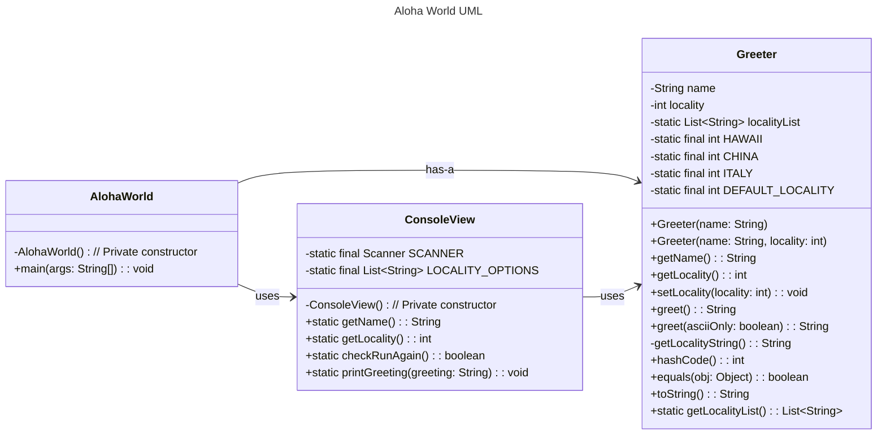

# Homework Aloha World Report

The following report contains questions you need to answer as part of your submission for the homework assignment. 

## Design Doc

Below is the UML diagram for the AlohaWorld application, which includes the `AlohaWorld`, `Greeter`, and `ConsoleView` classes.

### Program Flow
The **AlohaWorld** program begins execution in the `main` method of the `AlohaWorld` class. First, it prompts the user for their name and locality using the `ConsoleView` class. Then, an instance of `Greeter` is created with the provided name and locality. The program generates a greeting based on the locality and displays it using `ConsoleView.printGreeting()`. After displaying the greeting, the program asks if the user wants to be greeted again. If the user chooses to continue, they are prompted to select a new locality, which updates the `Greeter` instance before generating and displaying a new greeting. This loop continues until the user opts out. The `Greeter` class manages the greeting logic, while `ConsoleView` handles user input and output, ensuring a clear separation of concerns.

## Assignment Questions

1. List three additional java syntax items you didn't know when reading the code.  (make sure to use * for the list items, see example below, the backtick marks are used to write code inline with markdown)

   * `String.format()`
   * `package student; `
   * `@Override`

2. For each syntax additional item listed above, explain what it does in your own words and then link a resource where you figured out what it does in the references section. 

    * `String.format()` – This method is used to create formatted strings in Java, similar to `printf()` in C. It allows you to insert values dynamically into a string template. Super useful for cleaner, more readable code. 
    * `package student;` – This line declares that the class belongs to the `student` package. Packages are like folders in Java. They help organize code and avoid naming conflicts. 
    * `@Override` – This annotation tells the compiler that a method is overriding a method from its superclass. If there's a typo or mismatch, the compiler will catch it.
    * I learn all of them by [Oracle Java Docs](https://docs.oracle.com).

3. What does `main` do in Java? 

   The `main` method is the entry point of any Java application. When you run a Java program, the JVM looks for `public static void main(String[] args)` and starts execution from there. Without a `main` method, a Java application won't run.

4. What does `toString()` do in Java? Why should any object class you create have a `toString()` method?

   `toString()` is a method that provides a human-readable representation of an object. By default, it returns a memory address, but overriding it makes debugging way easier since you can print the information about an object.

5. What is javadoc style commenting? What is it used for? 

   Javadoc comments (`/** ... */`) are special multi-line comments used to generate documentation for Java classes and methods. They help the code writer and others who want to read the code easily and quickly to understand what a method or class does without digging into the code.

6. Describe Test Driving Development (TDD) in your own words. 

   TDD is like writing the exam before studying for it. You write test cases first, then write the actual code to pass those tests. This forces you to think about what your code should do and what exactly your goal is before you write it. It really helps you to have fewer bugs and better design.

7. Go to the [Markdown Playground](MarkdownPlayground.md) and add at least 3 different markdown elements you learned about by reading the markdown resources listed in the document. Additionally you need to add a mermaid class diagram (of your choice does not have to follow the assignment. However, if you did use mermaid for the assignment, you can just copy that there). Add the elements into the markdown file, so that the formatting changes are reserved to that file. 

## Deeper Thinking Questions

These questions require deeper thinking of the topic. We don't expect 100% correct answers, but we encourage you to think deeply and come up with a reasonable answer. 

1. Why would we want to keep interaction with the client contained to ConsoleView?

* One benefit is to capsule things together to improve the code reusability. So `ConsoleView` only cares about inputs and outputs, while other classes focus on other goals and logic. This makes it easier to modify how we interact with users. Also, it helps keep our code clean and maintainable.

2. Right now, the application isn't very dynamic in that it can be difficult to add new languages and greetings without modifying the code every time. Just thinking programmatically,  how could you make the application more dynamic? You are free to reference Geeting.java and how that could be used in your design.

* A better approach is to use a data-driven design, where greetings are stored externally, like in a JSON file or a database, instead of being hardcoded in Java.
Then, Greeting.java could load this data dynamically, so adding a new greeting wouldn't require any changes to the Java code.

> [!IMPORTANT]
>  After you upload the files to your github (ideally you have been committing throughout this progress / after you answer every question) - make sure to look at your completed assignment on github/in the browser! You can make sure images are showing up/formatting is correct, etc. The TAs will actually look at your assignment on github, so it is important that it is formatted correctly.

## References

[^1]: Final keyword in Java: 2024. https://www.geeksforgeeks.org/final-keyword-in-java/. Accessed: 2024-03-30. 

[^2]: Math (Java Platform SE 17). https://docs.oracle.com/en/java/javase/17/docs/api/java.base/java/lang/Math.html. Accessed: 2024-03-30.

[^3]: Data-Driven Design - Martin Fowler. https://martinfowler.com/articles/data-oriented-design.html. Accessed: 2024-03-30.

<!-- This is a comment, below this link the links in the document are placed here to make ti easier to read. This is an optional style for markdown, and often as a student you will include the links inline. for example [mermaid](https://mermaid.js.org/intro/syntax-reference.html) -->
[mermaid]: https://mermaid.js.org/intro/syntax-reference.html
[AlohaWorld.java]: src/main/java/student/AlohaWorld.java
[Greeter.java]: src/main/java/student/Greeter.java
[ConsoleView.java]: src/main/java/student/ConsoleView.java